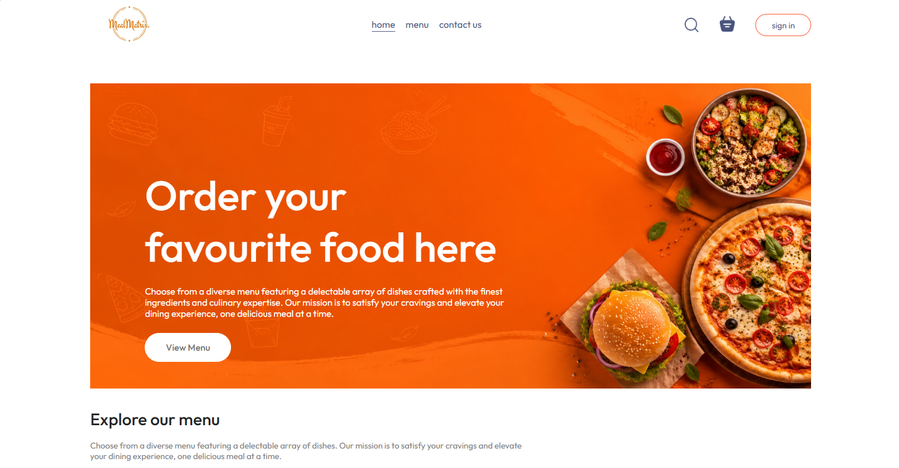
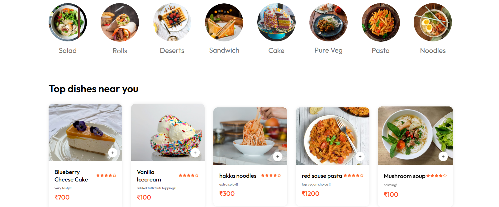
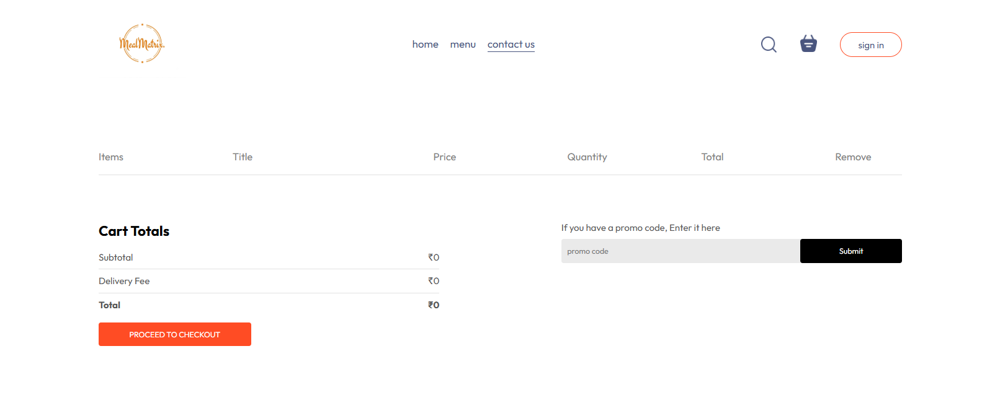
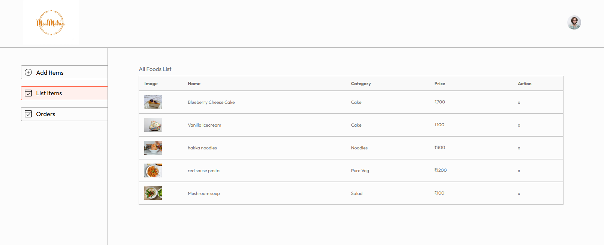

# MealMatrix

MealMatrix is a full-stack food ordering platform built using the MERN stack. The application provides customers with an intuitive food ordering experience while offering administrators a dedicated dashboard to manage menu items and customer orders.

The project follows a client-server architecture and demonstrates secure authentication, RESTful API development, database management, image handling, and responsive web design.

## Features

### Customer
- Secure user registration and authentication
- Browse menu items by category
- Add and remove items from the shopping cart
- Automatic cart total calculation
- Place food orders
- View previous orders and order status
- Responsive interface for desktop and mobile devices

### Administrator
- Dedicated admin dashboard
- Add, edit, and delete food items
- Manage customer orders
- Update order status

---

## Technology Stack

| Category | Technologies |
|----------|--------------|
| Frontend | React.js, React Router, Context API, Axios, HTML5, CSS3, JavaScript (ES6+) |
| Backend | Node.js, Express.js |
| Database | MongoDB Atlas, Mongoose |
| Authentication | JSON Web Token (JWT), bcrypt.js |
| Architecture | RESTful APIs, Client-Server Architecture |
| Database Operations | CRUD Operations, Atomic Updates |
| Version Control | Git, GitHub |

---

## Project Structure

```
MealMatrix/
│
├── admin/          # React Admin Dashboard
├── backend/        # Express REST API
├── frontend/       # React Client
│
├── Demo1.png
├── Demo2.png
├── Demo3.png
├── Demo4.png
│
└── README.md
```

---

## Installation

### Clone the repository

```bash
git clone https://github.com/shreyanshverma498-sudo/MealMatrix.git
cd MealMatrix
```

### Install dependencies

Frontend

```bash
cd frontend
npm install
```

Backend

```bash
cd ../backend
npm install
```

Admin Dashboard

```bash
cd ../admin
npm install
```

---

## Environment Variables

Create a `.env` file inside the `backend` directory.

```env
PORT=4000

MONGODB_URI=your_mongodb_connection_string

JWT_SECRET=your_secret_key
```

---

## Running the Application

Start the backend server.

```bash
cd backend
npm run server
```

Start the frontend.

```bash
cd frontend
npm run dev
```

Start the admin dashboard.

```bash
cd admin
npm run dev
```

---

## Application Preview

### Home Page



### Home Page



### Shopping Cart



### Admin Dashboard



---

## Future Improvements

- Payment gateway integration (Stripe or Razorpay)
- Real-time order tracking
- Customer reviews and ratings
- Coupons and promotional offers
- Advanced search and filtering
- Email notifications
- Progressive Web App (PWA) support

---

## Contributing

Contributions are welcome.

1. Fork the repository.
2. Create a new feature branch.

```bash
git checkout -b feature-name
```

3. Commit your changes.

```bash
git commit -m "Add feature"
```

4. Push the branch.

```bash
git push origin feature-name
```

5. Open a Pull Request.

---

## License

This project is licensed under the MIT License.

---

## Author

**Shreyansh Verma**

If you found this project useful, consider starring the repository.
